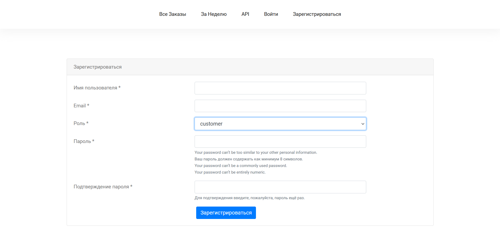

# itorum_test
Приложение для учета клиентов и заказов (тестовое задание на вакансию WEB-разработчик).
 

### Реализованы возможности:

1. Авторизованный пользователь может просматривать 
список всех заказов, а также удалять и добавлять заказ от конкретного
пользователя.  
2. Неавторизованный пользователь может просматривать
перечень заказов за конкретную неделю в пределах текущего месяца,
а также сумму заказов за выбранную неделю и перечень заказчиков, сделавших заказ
за эту неделю. 
3. Перечень заказов может быть передан в JSON-формате 
сторонней системе посредством API. 

### Особенности проекта:

1. Реализована кастомная модель юзера для разграничения ролей 
   обычных пользователей и заказчиков.  
2. При добавлении заказа либо при выборе заказов за конкретную неделю
подгрузка данных осуществляется без перезагрузки страницы с помощью AJAX.
 

### Запуск (docker):
1. Запустить docker-compose командой:
 
   docker-compose up -d
   
### Стек технологий:
Python(Django), SQLite3, JavaScript, HTML, CSS, Docker.

### Скриншоты:
Выбор заказов за конкретную неделю:

 
Просмотр всех заказов и их добавление/удаление:

 
Страница регистрации:
